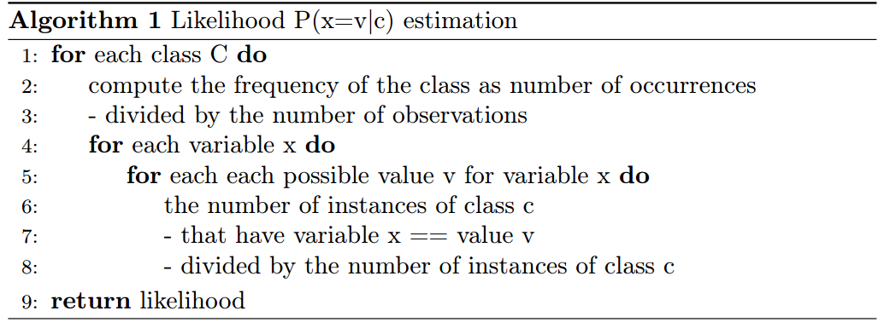
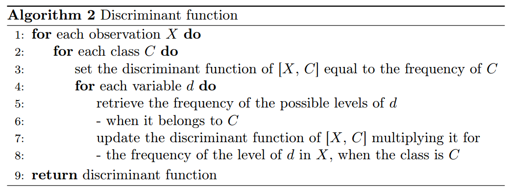
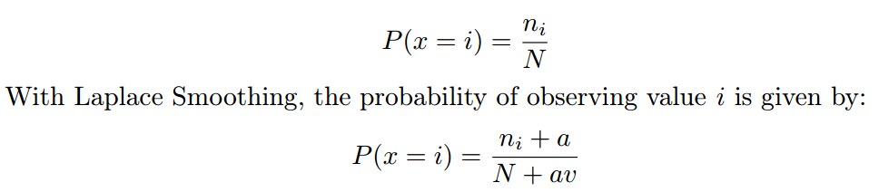

# Machine Learning 1
The assignments are:
1) Naive Bayes classifier
2) Linear regression
3) kNN Classifier

## 1) Naive Bayes classifier
The tasks of the I Assignment are:
- Task 1: Data preprocessing
- Task 2: Build a naive Bayes classifier
- Task 3: Improve the classifier with Laplace (additive) smoothing

### Introduction
The goal of this work is to develop a Naive Bayes Classifier using MATLAB.

### Methods
The Classifier will eventually be tested on a Weather data set.
The latter, as well as any other data set, needs some pre-processing in order to be manipulated from autonomous programs.
This particularly data set has some categorical features that needs to be converted to numeric form as soon as the raw data are loaded into the MATLAB workspace.
After all this representation conversions, the whole matrix data-type is changed, since the function used to load the data returns a cell matrix that is hard to work on.
This procedure is a lot quicker than a hand-done conversion, especially when it comes to data set with hundreds of thousands observations.
From the data set, the training and test set are randomly extrapolated.
This action is performed using a MATLAB function that returns random numbers used as indexes.

### Classification
Before the program starts the classification, it should check the given data are eligible to said classification.
First of all the test set’s number of features should match the training set’s one.
The number of columns could not match only when the training set has one more.
This happens when the test set doesn’t come with the target.
It’s also important the single units of data are consistent. Since the data set is preprocessed converting every possible level to a specific integer, no one of them should be lesser than one.
The program needs to know how many different classes it’s going to classify the observations into.
To do that, it simply count the number of unique values in the target column of the training set.
In order to compute the likelihood for each possible level of each attribute for every class, the software follows this algorithm: 

Practically, the returned likelihood matrix is a cell matrix with as many rows as the number of classes and as many columns as the number of attribute.
Each value of the matrix is an array that stores the frequency of each possible level of the specific attribute in the specific class.
With this data, it’s possible to compute the overall probability that a given observation belong to a class rather than another.

Now it’s possible to compare the values of the discriminant function for each observation.
The probable belonging class is going to be the one with a greater value.
Once the program computes and stores the estimated target in a matrix, it’s finally possible to elaborate the error rate.
This action is obviously executed only if the test set target is given.
It’s equal to the number of incorrect classification divided by the number of observations.

### Laplace smoothing
It happens, especially when working on a small data set such as the one in object, that some combinations appear exclusively in the test set.
In this case, the program would’ve tried to retrieve the frequency of a value never encountered before.
So, a particular statement would’ve set its probability to zero.
This assignment, even if it avoids errors in the code, is not correct; in fact, even if a particular value it’s not present in the training set, doesn’t mean its probability is zero.
In order to correct this behavior, it’s given the possibility, when calling the classifier function, to use the *Laplace (Additive) Smoothing algorithm*. This
introduces a different way to compute the probability of observing a specific value of a random variable *x*. Knowing there have been *N* experiments and that the value *i* occurs *ni* times, then:

Where *v* is the number of values of the attribute *x* and *a* is a parameter that express how the data needs to be trusted from the program.
With a value of a greater than zero, it’s possible to avoid the problem of zero probability.
In order to implement this algorithm, a few changes to the code are necessary:
- First of all, the program needs to know the number of levels of each at￾tribute. This information shall be given as an additional row of the training set;
- The program must remove the row with the number of levels before it starts to work on the training set.
  Also, if the program doesn’t know at prior the number of levels for each attribute, it shall count the number of unique level from the training set;
- Ultimately, if the Laplace smoothing function is active, the updated way of computing the probability of observing a specific value needs to be used.

## 2) Linear Regression
For the II Assignment, there is a report into the folder that explains what it consists of

## 3) kNN classifier
The tasks of the III Assignment are:
- Task 1: Obtain a dataset
- Task 2: Build a kNN classifier
- Task 3: Test the kNN classifiers

### Introduction
The goal of this work is to create a k-nearest neighbors classifier in MATLAB.
The k-nearest neighbors algorithm (k-NN) is a non-parametric classification method.
It doesn’t explicitly implement a model with parameters but directly build a discrimination rule from data.
The data set used as training and test set is the *mnist* dataset (To download it, click here [mnist dataset](https://2023.aulaweb.unige.it/pluginfile.php/211469/mod_assign/intro/mnist.zip)).
Its data represent handwritten digits in 28 by 28 grey scale images.
Those are split up in 10 classes that represent the numbers from 0 to 9.
Each class has at least 5800 occurrences in the training set and 890 occurrences in the test set.

### Methods

#### Data Elaboration
Since the great number of occurrences for each class of the data set, it’s necessary to reduce what will be the training set.
To do that, a specified percentage of the whole set is taken.
In the data set the different classes are distributed consecutively.
To be sure all the classes are represented equally in the subset, it’s necessary to take the observations randomly.
Another way could be to create each class subset one by one, and then fuse the 10 subsets to create the training set.

#### kNN classifier
The Nearest Neighbor rule is based on the assumption that observations which
are close together (in some appropriate metric) will have the same classification.
In other words, given a training set:
$$\X = {x1, ... , xl, ..., xn}$$
